# How to connect Sensy32 Board to ThingsBoard?

## Introduction
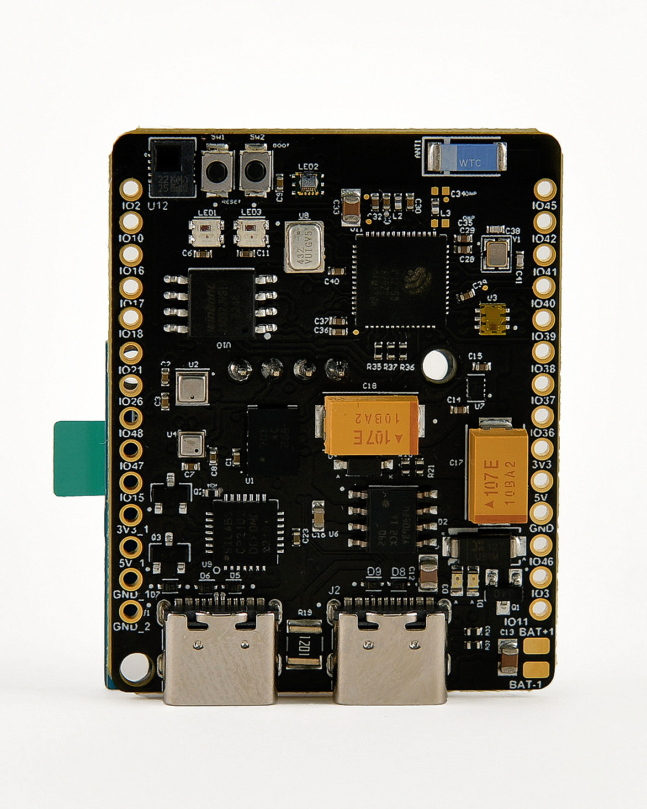

The Sensy32 is an IoT board designed for sensor enthusiasts, developers, and IoT creators. Powered by ESP32-S3 and packed with a wide array of sensors, it enables seamless monitoring, analysis, and visualization of real-world data.
The Sensy32 supports Wi-Fi and Bluetooth connectivity, complemented by two USB Type-C ports that enable charging and power supply, programming and firmware uploads, data communication, peripheral connectivity, and powering external devices such as sensors.

The Sensy32 board includes the following components and sensors:
* UV Light Sensor
* IR Motion and Human Presence Sensor
* Humidity and Temperature Sensor
* Altitude and Pressure Sensor
* 9-DOF Orientation IMU Sensor (Accelerometer/Magnetometer/Gyro)
* Microcontroller (ESP32-S3 Wi-Fi and Bluetooth)
* 32Mb Nor Flash Memory
* USB to Serial Converter
* Light Intensity Sensor
* Battery Charger
* RGB LEDs
* MEMS Microphone
* A built-in LCD screen that allows real-time monitoring and control

In this guide, we will learn how to create device on Thingsboard, install required libraries and tools. 
After this we will modify our code and upload it to the device, and check the results of our coding and check data on ThingsBoard using imported dashboard. 

### Prerequisites

To continue with this guide, we will need the following:
* [Arduino IDE][1]
* [CP210xVCP Driver][2]
* Sensy32 board
* [ThingsBoard Cloud (Europe)][3] or [ThingsBoard Cloud (America)][4]

## Create device on ThingsBoard
For simplicity, we will provide the device manually using the UI.
* Log in to your ThingsBoard instance and go to the **Entities** > **Devices** section.
* By default, you navigate to the device group “All”. Click the “+” button in the top-right corner and select **Add new device**.
* Enter a **device name**, for example “My New Device”. You can leave all other fields with their default values. Click Add to add the device.
* Your first device has been added.

<p>
  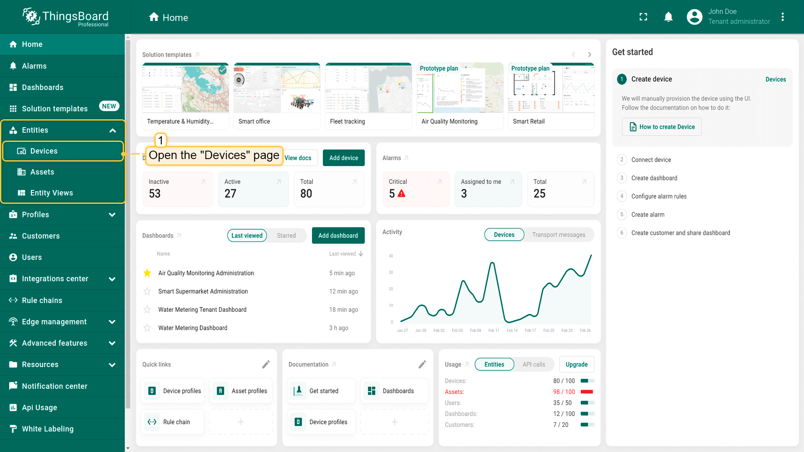
  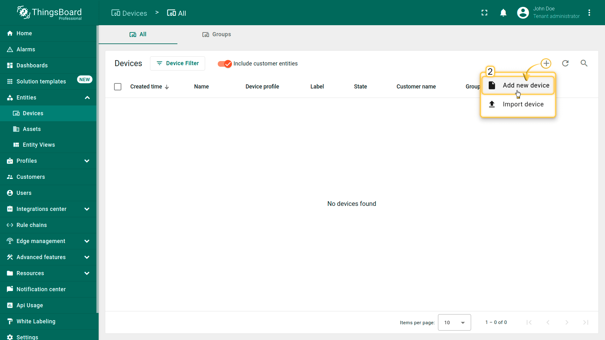
  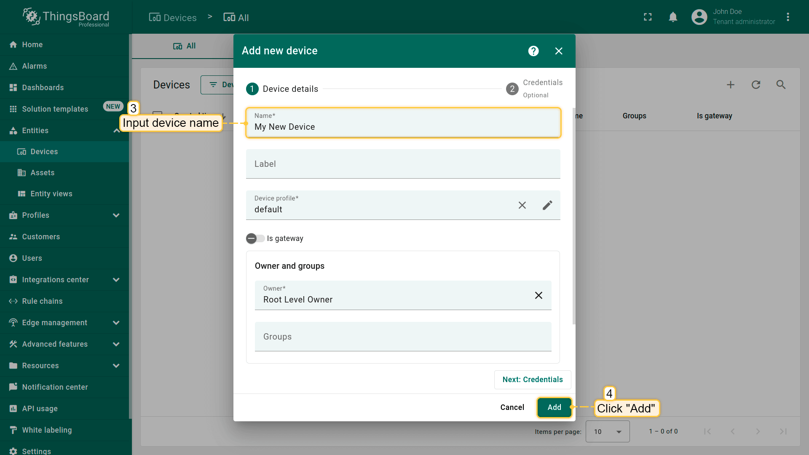
  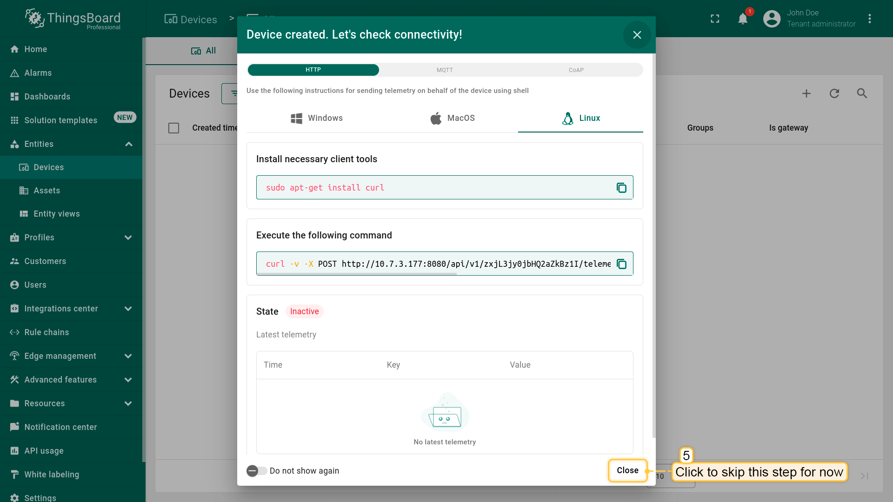
</p>

## Install required libraries and tools

Install the board for Arduino IDE:

Go to **File** > **Preferences** and add the following URL to the **Additional Boards Manager URLs** field: `https://dl.espressif.com/dl/package_esp32_index.json`

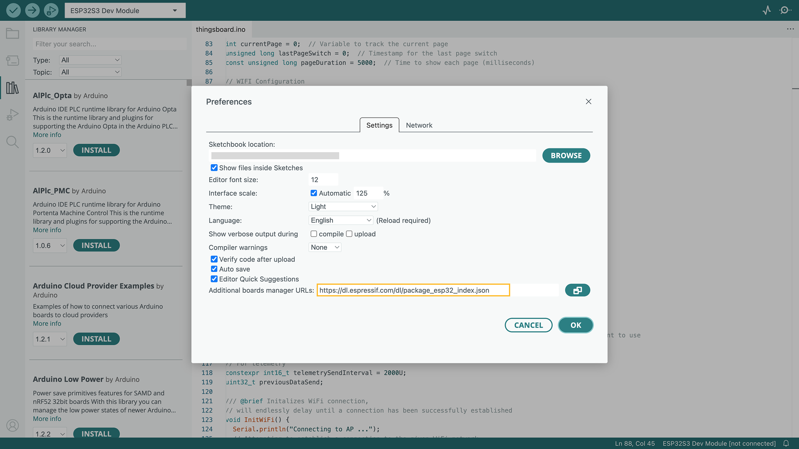


Then go to **Tools** > **Board** > **Board Manager** and install the **ESP32 by Espressif Systems** board.

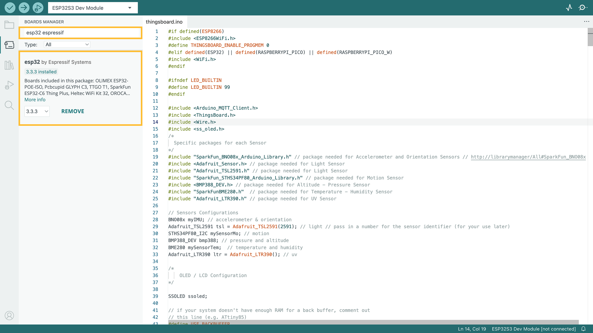

After the installation is complete, select the board by Board menu: **Tools** > **Board** > **ESP32** > **ESP32S3 Dev Module**.

Connect the device to computer using USB cable and select the port for the device: Tools > Port > /dev/ttyUSB0.

Port depends on operation system and may be different:

* for Linux it will be **/dev/ttyUSB**X
* for MacOS it will be **usb.serial**X.. or **usb.modem**X..
* for Windows - **COM**X.

Where X - some number, that was assigned by your system.

To install the needed libraries - we will need to do the following steps:

* Go to the “**Tools**” tab and click on “**Manage libraries**”.
* Enter the name of the following libraries in the search bar and click **INSTALL**: “**ThingsBoard**”, “**ss_oled**”, “**Adafruit TSL259**”, “**SparkFun BNO08x**”, “**SparkFun STHS34PF80**”, “**BMP388_DEV**”, “**SparkFun BME280**”, “**Adafruit LTR390 Library**”.
* If prompted to install library dependencies, simply click **Install All** to ensure all necessary libraries are installed.

<p>
  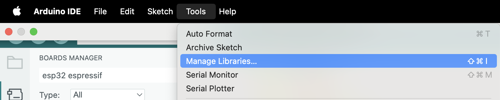
  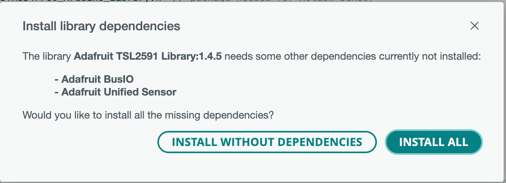
</p>

<br/>

<p>
  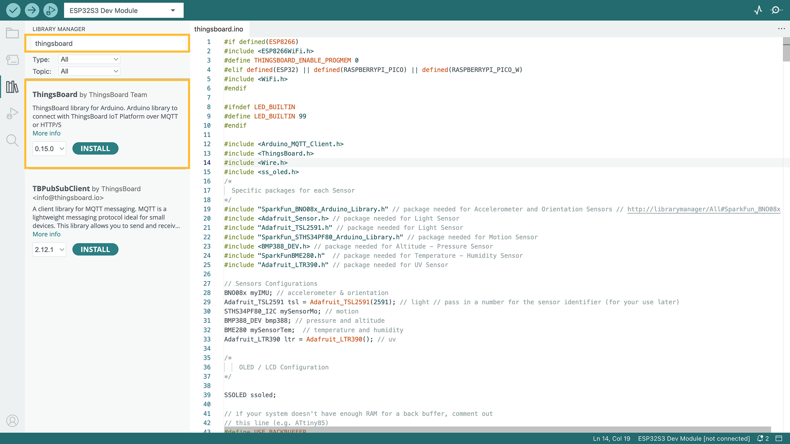
  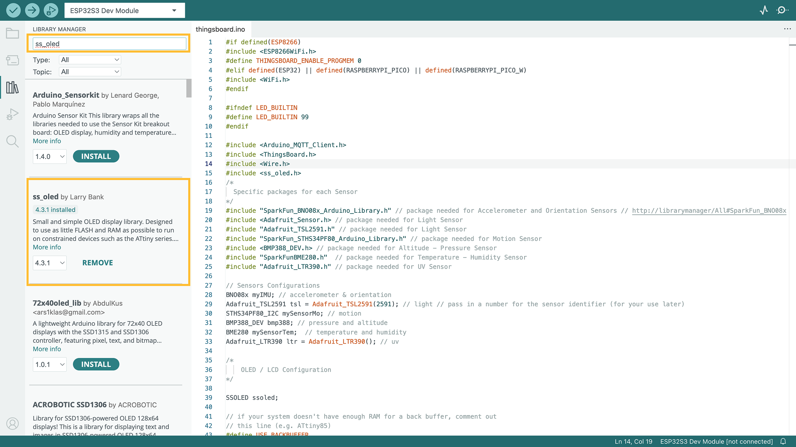
  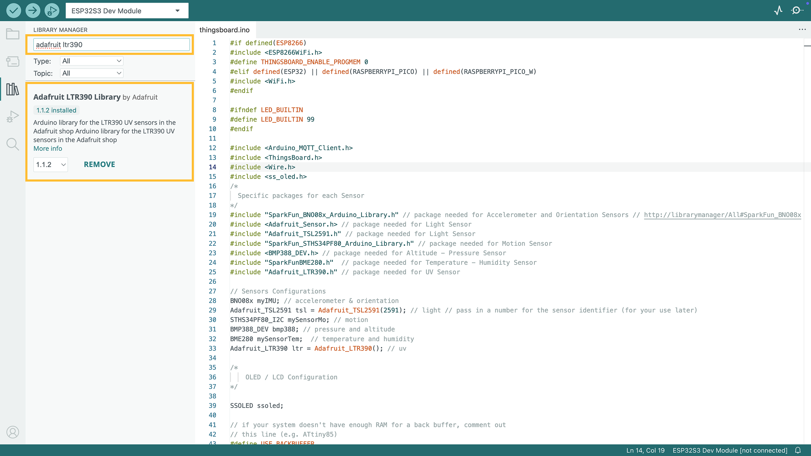
  
  
  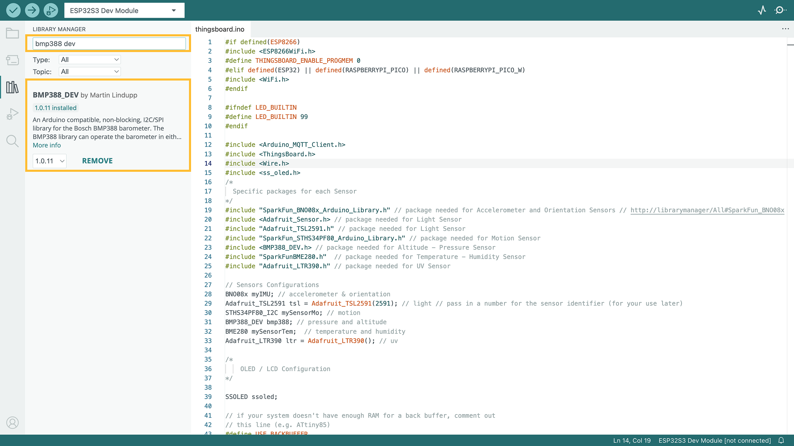
  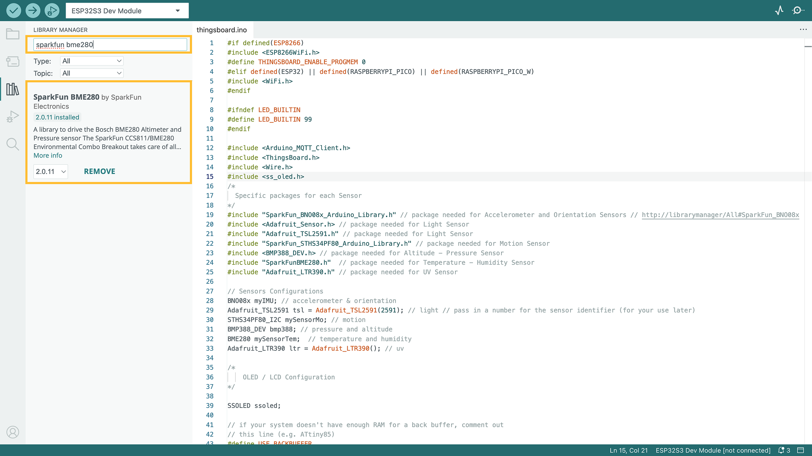
  
</p>

Let’s dive deeper to see what are these libraries are used for:
* **ThingsBoard**: This is the ThingsBoard Arduino SDK, used to connect with the ThingsBoard Platform.
* **ss_oled**: This library is used to configure and display data on the LCD screen.
* **SparkFunBME280**: This library helps work with the SparkFun BME280 sensor, allowing you to read temperature, humidity, and pressure data.
* **BMP388_DEV**: This library facilitates interaction with the BMP388 sensor module.
* **Adafruit_LTR390**: A library for communicating with the Adafruit_LTR390 UV sensor.
* **Adafruit_TSL2591**: A library for communicating with the Adafruit_TSL2591 Light sensor.
* **Adafruit_Sensor**: Provides common functionality for working without various sensors, simplifying sensor integration in projects.
* **SparkFun_BNO08x_Arduino_Library**: Simplifies interfacing with BNO08x series sensors in Arduino projects.
* **SparkFun_STHS34PF80_Arduino_Library**: Simplifies interfacing with the STHS34PF80 sensor in Arduino projects.

<span style="color: red;">All provided code examples require ThingsBoard Library version 0.14.0</span>

At this point, we have installed all required libraries and tools.

## Connect device to ThingsBoard

To connect your device, you’ll first need to get its credentials. While ThingsBoard supports a variety of device credentials, for this guide, we will use the default auto-generated credentials, which is an access token.

* Click on the device row in the table to open device details.
* Click “**Copy access token**”. The token will be copied to your clipboard. Please save it in a safe place.

<p>
  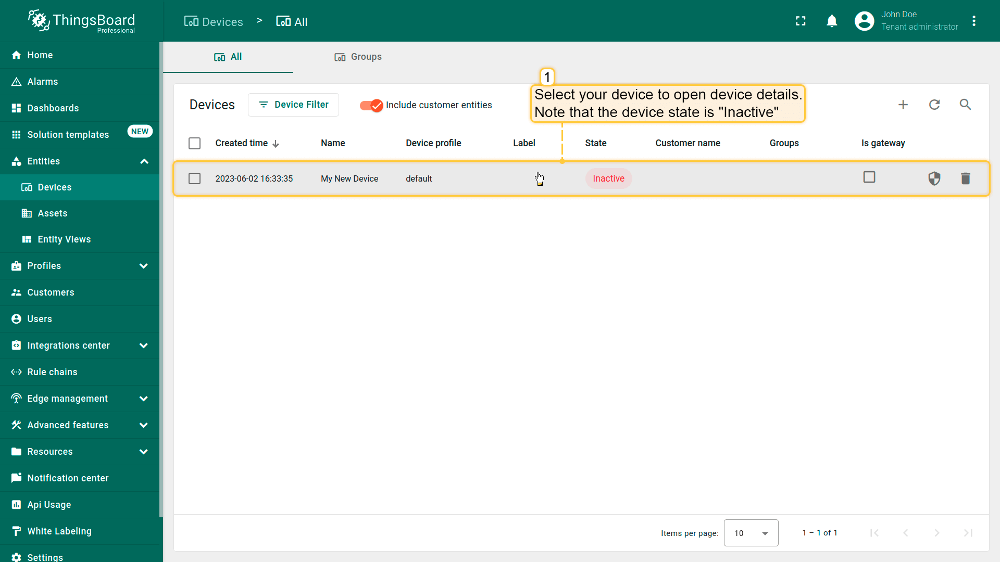
  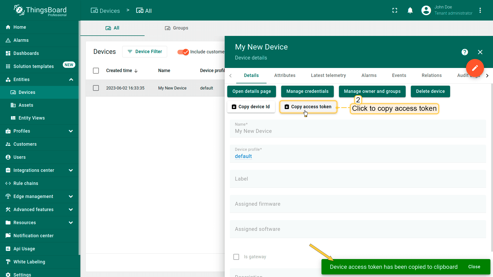
</p>

Now it’s time to program the board to read data, display it on the Sensy board LCD screen, and connect to ThingsBoard.

To do this, you can use the code below. It contains all required functionality for this guide.

``` arduino

#if defined(ESP8266)
#include <ESP8266WiFi.h>
#define THINGSBOARD_ENABLE_PROGMEM 0
#elif defined(ESP32) || defined(RASPBERRYPI_PICO) || defined(RASPBERRYPI_PICO_W)
#include <WiFi.h>
#endif

#ifndef LED_BUILTIN
#define LED_BUILTIN 99
#endif

#include <Arduino_MQTT_Client.h>
#include <ThingsBoard.h>
#include <Wire.h> 
#include <ss_oled.h>
/*
  Specific packages for each Sensor 
*/
#include "SparkFun_BNO08x_Arduino_Library.h" // package needed for Accelerometer and Orientation Sensors // http://librarymanager/All#SparkFun_BNO08x
#include <Adafruit_Sensor.h> // package needed for Light Sensor
#include "Adafruit_TSL2591.h" // package needed for Light Sensor
#include "SparkFun_STHS34PF80_Arduino_Library.h" // package needed for Motion Sensor
#include <BMP388_DEV.h> // package needed for Altitude - Pressure Sensor
#include "SparkFunBME280.h"  // package needed for Temperature - Humidity Sensor
#include "Adafruit_LTR390.h" // package needed for UV Sensor

// Sensors Configurations
BNO08x myIMU; // accelerometer & orientation
Adafruit_TSL2591 tsl = Adafruit_TSL2591(2591); // light // pass in a number for the sensor identifier (for your use later) 
STHS34PF80_I2C mySensorMo; // motion
BMP388_DEV bmp388; // pressure and altitude
BME280 mySensorTem;  // temperature and humidity
Adafruit_LTR390 ltr = Adafruit_LTR390(); // uv

/*
    OLED / LCD Configuration
*/

SSOLED ssoled; 

// if your system doesn't have enough RAM for a back buffer, comment out
// this line (e.g. ATtiny85)
#define USE_BACKBUFFER

#ifdef USE_BACKBUFFER
static uint8_t ucBackBuffer[1024];
#else
static uint8_t *ucBackBuffer = NULL;
#endif

// Use -1 for the Wire library default pins
// or specify the pin numbers to use with the Wire library or bit banging on any GPIO pins
// These are the pin numbers for the M5Stack Atom default I2C
#define SDA_PIN -1
#define SCL_PIN -1
// Set this to -1 to disable or the GPIO pin number connected to the reset
// line of your display if it requires an external reset
#define RESET_PIN -1
// let ss_oled figure out the display address
#define OLED_ADDR -1
// don't rotate the display
#define FLIP180 0
// don't invert the display
#define INVERT 0
// Bit-Bang the I2C bus
#define USE_HW_I2C 1

// Change these if you're using a different OLED display
#define MY_OLED OLED_128x64
#define OLED_WIDTH 128
#define OLED_HEIGHT 64

// Global Variables Definition
int16_t presenceVal = 0; // presence sensor
volatile boolean dataReady = false; // pressure and altitude sensor
float temperature, pressure, altitude, humidity, uvData, lux;
float quatI, quatJ, quatK, quatReal, quatRadianAccuracy;
float valX, valY, valZ;
uint16_t ir, full, visible;

int int_pin = 33; // pressure and altitude sensor

int currentPage = 0;  // Variable to track the current page
unsigned long lastPageSwitch = 0;  // Timestamp for the last page switch
const unsigned long pageDuration = 5000;  // Time to show each page (milliseconds)

// WIFI Configuration
constexpr char WIFI_SSID[] = "YOUR_WIFI_SSID";
constexpr char WIFI_PASSWORD[] = "YOUR_WIFI_PASSWORD";

// See https://thingsboard.io/docs/pe/getting-started-guides/helloworld/
// to understand how to obtain an access token
constexpr char TOKEN[] = "YOUR_DEVICE_ACCESS_TOKEN";

// Thingsboard we want to establish a connection too
constexpr char THINGSBOARD_SERVER[] = "thingsboard.cloud";
// MQTT port used to communicate with the server, 1883 is the default unencrypted MQTT port.
constexpr uint16_t THINGSBOARD_PORT = 1883U;

// Maximum size packets will ever be sent or received by the underlying MQTT client,
// if the size is to small messages might not be sent or received messages will be discarded
constexpr uint32_t MAX_MESSAGE_SIZE = 1024U;

// Baud rate for the debugging serial connection.
// If the Serial output is mangled, ensure to change the monitor speed accordingly to this variable
constexpr uint32_t SERIAL_DEBUG_BAUD = 115200U;

// Initialize underlying client, used to establish a connection
WiFiClient wifiClient;

// Initalize the Mqtt client instance
Arduino_MQTT_Client mqttClient(wifiClient);

// Initialize ThingsBoard instance with the maximum needed buffer size, stack size and the apis we want to use
ThingsBoard tb(mqttClient, MAX_MESSAGE_SIZE);

// For telemetry
constexpr int16_t telemetrySendInterval = 2000U;
uint32_t previousDataSend;

/// @brief Initalizes WiFi connection,
// will endlessly delay until a connection has been successfully established
void InitWiFi() {
  Serial.println("Connecting to AP ...");
  // Attempting to establish a connection to the given WiFi network
  WiFi.begin(WIFI_SSID, WIFI_PASSWORD);
  while (WiFi.status() != WL_CONNECTED) {
    // Delay 500ms until a connection has been succesfully established
    delay(500);
    Serial.print(".");
  }
  Serial.println("Connected to AP");
}

/// @brief Reconnects the WiFi uses InitWiFi if the connection has been removed
/// @return Returns true as soon as a connection has been established again
const bool reconnect() {
  // Check to ensure we aren't connected yet
  const wl_status_t status = WiFi.status();
  if (status == WL_CONNECTED) {
    return true;
  }

  // If we aren't establish a new connection to the given WiFi network
  InitWiFi();
  return true;
}

void setupLcd() { 
  //LCD Setup
  int rc;
  // The I2C SDA/SCL pins set to -1 means to use the default Wire library
  // If pins were specified, they would be bit-banged in software
  // oledInit(SSOLED *, type, oled_addr, rotate180, invert, bWire, SDA_PIN, SCL_PIN, RESET_PIN, speed)

  rc = oledInit(&ssoled, MY_OLED, OLED_ADDR, FLIP180, INVERT, USE_HW_I2C, SDA_PIN, SCL_PIN, RESET_PIN, 400000L);  // use standard I2C bus at 400Khz
  if (rc != OLED_NOT_FOUND) {
    char *msgs[] = { (char *)"SSD1306 @ 0x3C", (char *)"SSD1306 @ 0x3D", (char *)"SH1106 @ 0x3C", (char *)"SH1106 @ 0x3D" };
    oledFill(&ssoled, 0, 1);
    oledWriteString(&ssoled, 0, 0, 0, msgs[rc], FONT_NORMAL, 0, 1);
    oledSetBackBuffer(&ssoled, ucBackBuffer);
    delay(2000);
  
}
}

// Here is where you define the sensor outputs you want to receive
void setReports(void) {
  Serial.println("Setting desired reports");

  // Enable accelerometer
  if (myIMU.enableAccelerometer() == true) {
    Serial.println("Accelerometer enabled");
    Serial.println("Output: x, y, z (m/s^2)");
  } else {
    Serial.println("Could not enable accelerometer");
  }

  // Enable rotation vector
  if (myIMU.enableRotationVector() == true) {
    Serial.println("Rotation vector enabled");
    Serial.println("Output: i, j, k, real, accuracy");
  } else {
    Serial.println("Could not enable rotation vector");
  }
}

void setup() {
  // Initialize serial connection for debugging
  Serial.begin(SERIAL_DEBUG_BAUD);
  Serial.println();
  Wire.begin(7, 6);
  InitWiFi();
  if (LED_BUILTIN != 99) {
    pinMode(LED_BUILTIN, OUTPUT);
  }
  while (!Serial) delay(10); // Wait for Serial to become available

  mySensorTem.setI2CAddress(0x76); // Initialize Temperature/Humidity Sensor

  if(tsl.begin()==false){ // light 
    Serial.println("No sensor for Light found ... check your wiring?");
    while (1);
  } else if(mySensorMo.begin()==false){ // motion
    Serial.println("No sensor for Motion found ... check your wiring?");
    while (1);
  }  else if(bmp388.begin()==false){ // pressure and altitude
    Serial.println("No BMP388 Sensor found for Pressure and Altitude.");
    while (1); 
  } else if (mySensorTem.beginI2C(Wire)==false){ // temperature and humidity //Begin communication over I2C
    Serial.println("No BMP388 Sensor found for Temperature and Humidity.");
    while (1); 
  }else if (ltr.begin()==false) { // uv
    Serial.println("Couldn't find LTR sensor for UV!");
    while (1);
  }else if (myIMU.begin() == false) {  // acccelerometer and orientation
    Serial.println("BNO08x not detected. Check connections. Freezing...");
    while (1);
  }

  // light
  Serial.println("Found a TSL2591 for Light sensor.");
  displayLightSensorDetails();
  configureLightSensor();

  // motion
  Serial.println("Found a STHS34PF80_I2C for Motion sensor.");
  Serial.println("Open the Serial Plotter for graphical viewing");
  delay(1000);

  // pressure and altitude
  bmp388.enableInterrupt();                                                   // Enable the BMP388's interrupt (INT) pin
  attachInterrupt(digitalPinToInterrupt(int_pin), interruptHandler, RISING);  // Set interrupt to call interruptHandler function on D2
  bmp388.setTimeStandby(TIME_STANDBY_1280MS);                                 // Set the standby time to 1.3 seconds
  bmp388.startNormalConversion();                                             // Start BMP388 continuous conversion in NORMAL_MODE
  Serial.println("BMP388 Sensor found for Pressure and Altitude.");

  // temperature and humidity
  Serial.println("BME280 Sensor found for Temperature and Humidity.");

  // uv 
  Serial.println("Found a LTR sensor for UV!");
  ltr.setMode(LTR390_MODE_UVS);
  if (ltr.getMode() == LTR390_MODE_ALS) {
    Serial.println("LTR sensor is in ALS mode");
  } else {
    Serial.println("LTR sensor is in UVS mode");
  }

  ltr.setGain(LTR390_GAIN_3);
  Serial.println("LTR sensor Gain : ");
  switch (ltr.getGain()) {
    case LTR390_GAIN_1: Serial.println(1); break;
    case LTR390_GAIN_3: Serial.println(3); break;
    case LTR390_GAIN_6: Serial.println(6); break;
    case LTR390_GAIN_9: Serial.println(9); break;
    case LTR390_GAIN_18: Serial.println(18); break;
  }

  ltr.setResolution(LTR390_RESOLUTION_16BIT);
  Serial.println("LTR sensor Resolution : ");
  switch (ltr.getResolution()) {
    case LTR390_RESOLUTION_13BIT: Serial.println(13); break;
    case LTR390_RESOLUTION_16BIT: Serial.println(16); break;
    case LTR390_RESOLUTION_17BIT: Serial.println(17); break;
    case LTR390_RESOLUTION_18BIT: Serial.println(18); break;
    case LTR390_RESOLUTION_19BIT: Serial.println(19); break;
    case LTR390_RESOLUTION_20BIT: Serial.println(20); break;
  }

  ltr.setThresholds(100, 1000);
  ltr.configInterrupt(true, LTR390_MODE_UVS);

  // acccelerometer and orientation
  Serial.println("BNO08x found!");
  setReports();

  setupLcd();
}

void displayLightSensorDetails(void) {
  sensor_t sensor;
  tsl.getSensor(&sensor);
  Serial.println(F("------------------------------------"));
  Serial.print(F("Sensor:       "));
  Serial.println(sensor.name);
  Serial.print(F("Driver Ver:   "));
  Serial.println(sensor.version);
  Serial.print(F("Unique ID:    "));
  Serial.println(sensor.sensor_id);
  Serial.print(F("Max Value:    "));
  Serial.print(sensor.max_value);
  Serial.println(F(" lux"));
  Serial.print(F("Min Value:    "));
  Serial.print(sensor.min_value);
  Serial.println(F(" lux"));
  Serial.print(F("Resolution:   "));
  Serial.print(sensor.resolution, 4);
  Serial.println(F(" lux"));
  Serial.println(F("------------------------------------"));
  Serial.println(F(""));
  delay(500);
}

void interruptHandler() { // Interrupt handler function
  dataReady = true;  // Set the dataReady flag
}

void configureLightSensor(void) {
  // You can change the gain on the fly, to adapt to brighter/dimmer light situations
  //tsl.setGain(TSL2591_GAIN_LOW);    // 1x gain (bright light)
  tsl.setGain(TSL2591_GAIN_MED);  // 25x gain
  //tsl.setGain(TSL2591_GAIN_HIGH);   // 428x gain

  // Changing the integration time gives you a longer time over which to sense light
  // longer timelines are slower, but are good in very low light situtations!
  //  tsl.setTiming(TSL2591_INTEGRATIONTIME_100MS);  // shortest integration time (bright light)
  // tsl.setTiming(TSL2591_INTEGRATIONTIME_200MS);
  tsl.setTiming(TSL2591_INTEGRATIONTIME_300MS);
  // tsl.setTiming(TSL2591_INTEGRATIONTIME_400MS);
  // tsl.setTiming(TSL2591_INTEGRATIONTIME_500MS);
  // tsl.setTiming(TSL2591_INTEGRATIONTIME_600MS);  // longest integration time (dim light)

  /* Display the gain and integration time for reference sake */
  Serial.println(F("------------------------------------"));
  Serial.print(F("Gain:         "));
  tsl2591Gain_t gain = tsl.getGain();
  switch (gain) {
    case TSL2591_GAIN_LOW:
      Serial.println(F("1x (Low)"));
      break;
    case TSL2591_GAIN_MED:
      Serial.println(F("25x (Medium)"));
      break;
    case TSL2591_GAIN_HIGH:
      Serial.println(F("428x (High)"));
      break;
    case TSL2591_GAIN_MAX:
      Serial.println(F("9876x (Max)"));
      break;
  }
  Serial.print(F("Timing:       "));
  Serial.print((tsl.getTiming() + 1) * 100, DEC);
  Serial.println(F(" ms"));
  Serial.println(F("------------------------------------"));
  Serial.println(F(""));
}

void getLightData(void){
  // More advanced data read example. Read 32 bits with top 16 bits IR, bottom 16 bits full spectrum
  // That way you can do whatever math and comparisons you want!
  uint32_t lum = tsl.getFullLuminosity();
  ir = lum >> 16;
  full = lum & 0xFFFF;
  visible = full - ir;
  lux = tsl.calculateLux(full, ir);
  Serial.print(F("[ "));
  Serial.print(millis());
  Serial.print(F(" ms ] "));
  Serial.print(F("IR: "));
  Serial.print(ir);
  Serial.print(F("  "));
  Serial.print(F("Full: "));
  Serial.print(full);
  Serial.print(F("  "));
  Serial.print(F("Visible: "));
  Serial.print(visible);
  Serial.print(F("  "));
  Serial.print(F("Lux: "));
  Serial.println(lux, 6);
}

void getPressureAltitudeData(void) {
    bmp388.getMeasurements(temperature, pressure, altitude);  // Read the measurements
    Serial.print("Temperature: ");
    Serial.print(temperature);                                // Display the results
    Serial.print(F("*C   "));
    Serial.print(" Pressure: ");
    Serial.print(pressure);
    Serial.print(F("hPa   "));
    Serial.print(" Altitude: ");
    Serial.print(altitude);
    Serial.println(F("m"));
}

void getTemperatureHumidityData(void){
  temperature = mySensorTem.readTempC();
  humidity = mySensorTem.readFloatHumidity();
  pressure = (mySensorTem.readFloatPressure()/100);
  altitude = mySensorTem.readFloatAltitudeMeters();
  
  if (isnan(temperature) || isnan(humidity) || isnan(pressure) || isnan(altitude)) {
    Serial.println("Error reading sensor data");
    return;
  }
  Serial.print("Humidity: ");
  Serial.print(humidity, 0);
  Serial.print(F("g.m-3   "));

  Serial.print(" Pressure: ");
  Serial.print(pressure, 0);
  Serial.print(F("hPa   "));

  Serial.print(" Altitude: ");
  Serial.print(altitude, 1);
  Serial.print(F("m  "));

  Serial.print(" Temperature: ");
  Serial.print(temperature, 2);
  Serial.println(F("*C   "));

}

void getUvSensorData(void){
  Serial.print("UV data: ");
  uvData = ltr.readUVS();
  Serial.println(uvData);
}

void getMotionData(void){
  sths34pf80_tmos_drdy_status_t dataReady;
  mySensorMo.getDataReady(&dataReady);
  mySensorMo.getPresenceValue(&presenceVal);
  Serial.print("Presence Value: ");
  Serial.println(presenceVal);
}

void getAccelerometerOrientationData(void){
  // Check if the sensor has been reset

  if (myIMU.wasReset()) {
    Serial.println("Sensor was reset. Re-enabling reports...");
    setReports();
  }

  // Check if a new sensor event has occurred
  if (myIMU.getSensorEvent() == true) {
    // Handle accelerometer data
    if (myIMU.getSensorEventID() == SENSOR_REPORTID_ACCELEROMETER) {
      valX = myIMU.getAccelX();
      valY = myIMU.getAccelY();
      valZ = myIMU.getAccelZ();

      Serial.print("Accelerometer: ");
      Serial.print("X=");
      Serial.print(valX, 2);
      Serial.print(" Y=");
      Serial.print(valY, 2);
      Serial.print(" Z=");
      Serial.println(valZ, 2);
    }

    // Handle rotation vector data
    if (myIMU.getSensorEventID() == SENSOR_REPORTID_ROTATION_VECTOR) {
      quatI = myIMU.getQuatI();
      quatJ = myIMU.getQuatJ();
      quatK = myIMU.getQuatK();
      quatReal = myIMU.getQuatReal();
      quatRadianAccuracy = myIMU.getQuatRadianAccuracy();

      Serial.print("Rotation Vector: ");
      Serial.print("i=");
      Serial.print(quatI, 2);
      Serial.print(" j=");
      Serial.print(quatJ, 2);
      Serial.print(" k=");
      Serial.print(quatK, 2);
      Serial.print(" real=");
      Serial.print(quatReal, 2);
      Serial.print(" accuracy=");
      Serial.println(quatRadianAccuracy, 2);
    }
  }
}

void sendDataToLcd() {
  int i, x, y;
  char szTemp[32];
  unsigned long ms;
  unsigned long now = millis();

  // Check if it's time to switch the page
  if (now - lastPageSwitch > pageDuration) {
    lastPageSwitch = now;  // Update timestamp
    currentPage = (currentPage + 1) % 7;  // Cycle through 6 pages (0 to 6)
  }

  // Clear the OLED display before drawing new content
  oledFill(&ssoled, 0x0, 1);

  // Display content based on the current page
  switch (currentPage) {
    case 0:  // Light page
      oledWriteString(&ssoled, 0, 3, 1, (char *)"IR:", FONT_SMALL, 0, 1);
      dtostrf(ir, 10, 2, szTemp);
      oledWriteString(&ssoled, 0, 50, 1, szTemp, FONT_SMALL, 0, 1);

      oledWriteString(&ssoled, 0, 3, 3, (char *)"Full:", FONT_SMALL, 0, 1);
      dtostrf(full, 10, 2, szTemp);
      oledWriteString(&ssoled, 0, 50, 3, szTemp, FONT_SMALL, 0, 1);

      oledWriteString(&ssoled, 0, 3, 5, (char *)"Visible:", FONT_SMALL, 0, 1);
      dtostrf(visible, 10, 2, szTemp);
      oledWriteString(&ssoled, 0, 50, 5, szTemp, FONT_SMALL, 0, 1);

      oledWriteString(&ssoled, 0, 3, 7, (char *)"Lux:", FONT_SMALL, 0, 1);
      dtostrf(lux, 10, 2, szTemp);
      oledWriteString(&ssoled, 0, 50, 7, szTemp, FONT_SMALL, 0, 1);
      break;

    case 1:  // Altitude & pressure page
      oledWriteString(&ssoled, 0, 3, 3, (char *)"Altitude:", FONT_SMALL, 0, 1);
      dtostrf(altitude, 10, 2, szTemp);
      oledWriteString(&ssoled, 0, 56, 3, szTemp, FONT_SMALL, 0, 1);

      oledWriteString(&ssoled, 0, 3, 5, (char *)"Pressure:", FONT_SMALL, 0, 1);
      dtostrf(pressure, 10, 2, szTemp);
      oledWriteString(&ssoled, 0, 56, 5, szTemp, FONT_SMALL, 0, 1);
      break;

    case 2:  // Temperature & humidity page
      oledWriteString(&ssoled, 0, 3, 3, (char *)"Temp:", FONT_SMALL, 0, 1);
      dtostrf(temperature, 10, 2, szTemp);
      oledWriteString(&ssoled, 0, 56, 3, szTemp, FONT_SMALL, 0, 1);

      oledWriteString(&ssoled, 0, 3, 5, (char *)"Humidity:", FONT_SMALL, 0, 1);
      dtostrf(humidity, 10, 2, szTemp);
      oledWriteString(&ssoled, 0, 56, 5, szTemp, FONT_SMALL, 0, 1);
      break;

    case 3:  // UV & Presence page
      oledWriteString(&ssoled, 0, 3, 3, (char *)"UV:", FONT_SMALL, 0, 1);
      dtostrf(uvData, 10, 2, szTemp);
      oledWriteString(&ssoled, 0, 56, 3, szTemp, FONT_SMALL, 0, 1);

      oledWriteString(&ssoled, 0, 3, 5, (char *)"Presence:", FONT_SMALL, 0, 1);
      dtostrf(presenceVal, 10, 2, szTemp);
      oledWriteString(&ssoled, 0, 56, 5, szTemp, FONT_SMALL, 0, 1);
      break;

    case 4:  // Accelerometer page
      oledWriteString(&ssoled, 0, 25, 2, (char *)"X:", FONT_SMALL, 0, 1);
      dtostrf(valX, 10, 2, szTemp);
      oledWriteString(&ssoled, 0, 35, 2, szTemp, FONT_SMALL, 0, 1);

      oledWriteString(&ssoled, 0, 25, 4, (char *)"Y:", FONT_SMALL, 0, 1);
      dtostrf(valY, 10, 2, szTemp);
      oledWriteString(&ssoled, 0, 35, 4, szTemp, FONT_SMALL, 0, 1);

      oledWriteString(&ssoled, 0, 25, 6, (char *)"Z:", FONT_SMALL, 0, 1);
      dtostrf(valZ, 10, 2, szTemp);
      oledWriteString(&ssoled, 0, 35, 6, szTemp, FONT_SMALL, 0, 1);
      break;

    case 5:  // Orientation  1st page
      oledWriteString(&ssoled, 0, 25, 2, (char *)"I:", FONT_SMALL, 0, 1);
      dtostrf(quatI, 10, 2, szTemp);
      oledWriteString(&ssoled, 0, 35, 2, szTemp, FONT_SMALL, 0, 1);

      oledWriteString(&ssoled, 0, 25, 4, (char *)"J:", FONT_SMALL, 0, 1);
      dtostrf(quatJ, 10, 2, szTemp);
      oledWriteString(&ssoled, 0, 35, 4, szTemp, FONT_SMALL, 0, 1);

      oledWriteString(&ssoled, 0, 25, 6, (char *)"K:", FONT_SMALL, 0, 1);
      dtostrf(quatK, 10, 2, szTemp);
      oledWriteString(&ssoled, 0, 35, 6, szTemp, FONT_SMALL, 0, 1);
      break;
    
    case 6:  // Orientation 2nd page
      oledWriteString(&ssoled, 0, 3, 3, (char *)"Real:", FONT_SMALL, 0, 1);
      dtostrf(quatReal, 10, 2, szTemp);
      oledWriteString(&ssoled, 0, 56, 3, szTemp, FONT_SMALL, 0, 1);

      oledWriteString(&ssoled, 0, 3, 5, (char *)"Accuracy:", FONT_SMALL, 0, 1);
      dtostrf(quatRadianAccuracy, 10, 2, szTemp);
      oledWriteString(&ssoled, 0, 56, 5, szTemp, FONT_SMALL, 0, 1);
      break;
  }
}

void loop() {
  delay(10);

  if (!reconnect()) {
    return;
  }

  if (!tb.connected()) {
    // Connect to the ThingsBoard
    Serial.print("Connecting to: ");
    Serial.print(THINGSBOARD_SERVER);
    Serial.print(" with token ");
    Serial.println(TOKEN);

    if (!tb.connect(THINGSBOARD_SERVER, TOKEN, THINGSBOARD_PORT)) {
      Serial.println("Failed to connect");
      return;
    }
    // Sending a MAC address as an attribute
    tb.sendAttributeData("macAddress", WiFi.macAddress().c_str());

  }

  // Sending telemetry every telemetrySendInterval time
  if (millis() - previousDataSend > telemetrySendInterval) {
    previousDataSend = millis();
    Serial.println();

    // light sensor
    Serial.println(F("------------------------- Light Sensor --------------------------"));
    getLightData();
    Serial.println();

    // altitude and pressure sensor
    Serial.println(F("---------------- Pressure and Altitude Sensor --------------------"));
    getPressureAltitudeData();
    Serial.println();

    // temperature and humidity sensor
    Serial.println(F("---------------- Temperature and Humidity Sensor ------------------"));
    getTemperatureHumidityData();
    Serial.println();

    // uv sensor
    Serial.println(F("----------------------------- UV Sensor ---------------------------"));
    getUvSensorData();
    Serial.println();

    // motion sensor
    Serial.println(F("-------------------------- Motion Sensor --------------------------"));
    getMotionData();
    Serial.println();

    // accelerometer and orientation sensor
    Serial.println(F("------------- Accelerometer and Orientation Sensor ----------------"));
    getAccelerometerOrientationData();
    Serial.println();

    // Send Data to LCD
    sendDataToLcd();

    // Send Data to ThingsBoard
    // end temperture data
    tb.sendTelemetryData("temperature", temperature);
    // send humidity data 
    tb.sendTelemetryData("humidity", humidity); 
    // send altitude data
    tb.sendTelemetryData("altitude", altitude); 
    // send pressure data
    tb.sendTelemetryData("pressure", pressure); 
    // send motion data
    tb.sendTelemetryData("motion", presenceVal); 
    // send uv data
    tb.sendTelemetryData("uv", uvData);
    // send accelerometer data
    tb.sendTelemetryData("valX", valX); 
    tb.sendTelemetryData("valY", valY); 
    tb.sendTelemetryData("valZ", valZ);
    // send orientation data
    tb.sendTelemetryData("quatI", quatI); 
    tb.sendTelemetryData("quatJ", quatJ); 
    tb.sendTelemetryData("quatK", quatK);
    tb.sendTelemetryData("quatReal", quatReal); 
    tb.sendTelemetryData("quatRadianAccuracy", quatRadianAccuracy); 
    // send light data
    tb.sendTelemetryData("ir", ir); 
    tb.sendTelemetryData("full", full); 
    tb.sendTelemetryData("visible", visible);
    tb.sendTelemetryData("lux", lux);
    // send some WiFi information
    tb.sendAttributeData("rssi", WiFi.RSSI());
    tb.sendAttributeData("channel", WiFi.channel());
    tb.sendAttributeData("bssid", WiFi.BSSIDstr().c_str());
    tb.sendAttributeData("localIp", WiFi.localIP().toString().c_str());
    tb.sendAttributeData("ssid", WiFi.SSID().c_str());
  }

  tb.loop();
}
```

<span style="color:blue;"> Don’t forget to replace placeholders with your real WiFi network SSID, password, ThingsBoard device access token. </span>

`constexpr char WIFI_SSID[] = "YOUR_WIFI_SSID";`
`constexpr char WIFI_PASSWORD[] = "YOUR_WIFI_PASSWORD";`
`constexpr char TOKEN[] = "YOUR_ACCESS_TOKEN";`

Then upload the code to the device by pressing the Upload button or keyboard combination Ctrl+U.

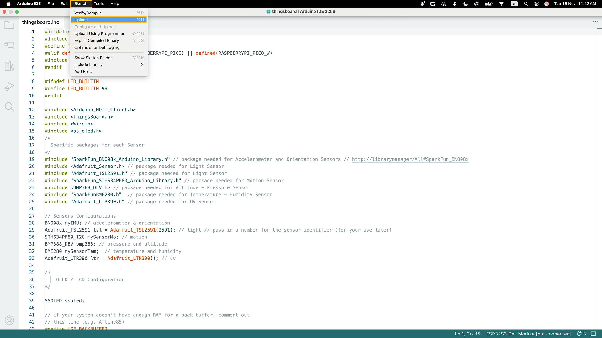

If you cannot upload the code and receive an error: <span style="color: red;">Property 'upload.tool.serial' is undefined</span> you can do the following:
* Go to “**Tools**” > “**Programmer**” and select “**Esptool**” as a programmer.
* Go to “**Sketch**” > “**Upload Using Programmer**”.

<p>
  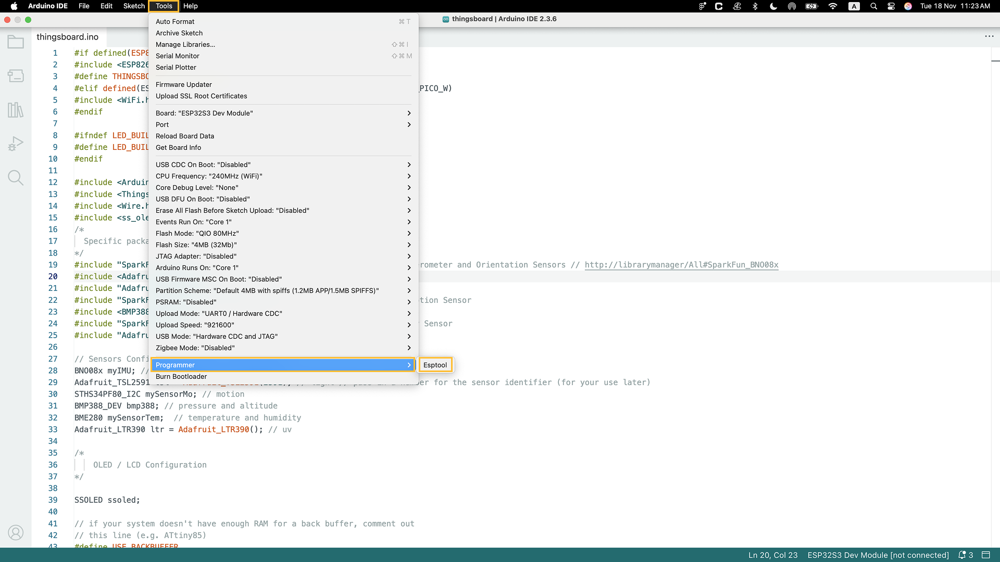
  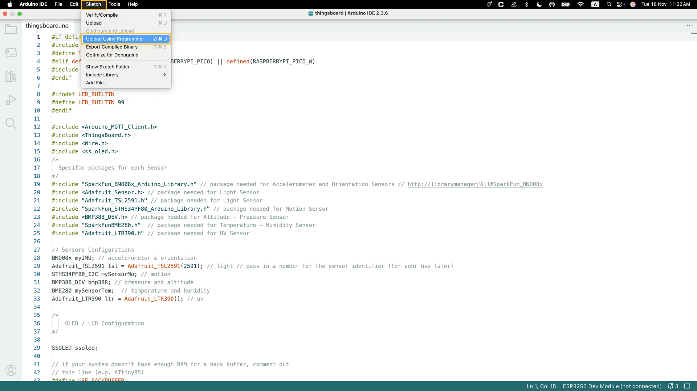
</p>

## Check data on ThingsBoard

ThingsBoard provides the ability to create and customize interactive visualizations (dashboards) for monitoring and managing data and devices.

Through ThingsBoard dashboards, you can efficiently manage and monitor your IoT devices and data. So, we will create the dashboard for our device.

To do this, you can either create your own dashboard using custom widgets or import a ready-made one. 
In this example we will upload a ready-to-use dashboard. You can also customize it or create your own.

To import the ready-to-use dashboard, follow these steps:

* First download the My Dashboard file.
* Navigate to the “**Dashboards**” page. By default, you navigate to the dashboard group “All”. Click on the “+” icon in the top right corner. Select “**Import dashboard**”.
* In the dashboard import window, upload the JSON file and click the “**Import**” button.
* Dashboard has been imported

<p>
  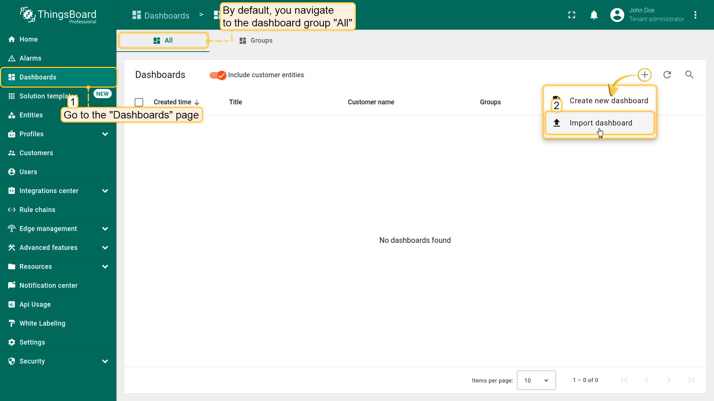
  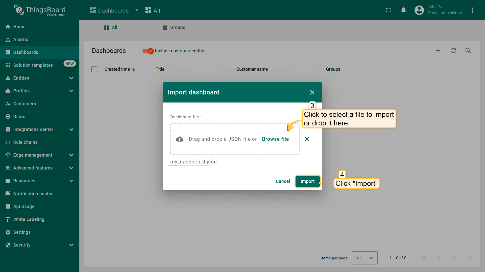
  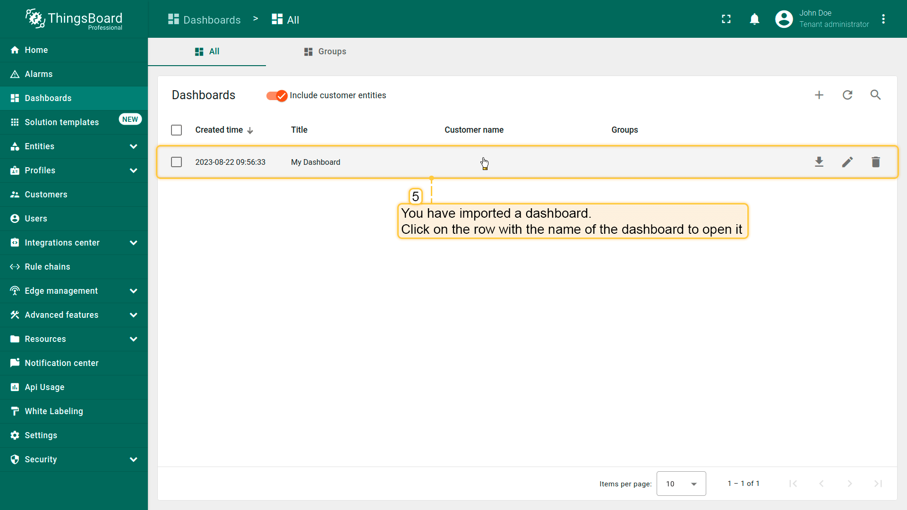
</p>

The “My Dashboard” structure:
* To check the data from our device we need to open the imported dashboard by clicking on it in the table.
* The view of “My Dashboard” containing widgets representing the following telemetry values: **temperature**, **humidity**, **altitude**, **pressure**, **motion**, **uv**, **accelerometer** (**valX**, **valY**, and **valZ**), **orientation** (**quatI**, **quatJ**, **quatK**, **quatReal**, and **quatRadianAccuracy**), **light** (**ir**, **full**, **visible**, and **lux**). 

* We can also add a Widget to display device & Wi-Fi information.

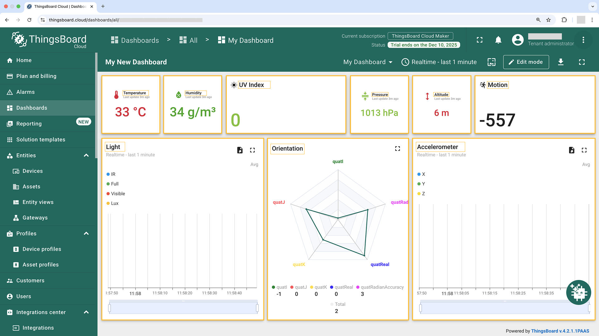

## Conclusion

Now you can easily connect your **Sensy32** board and start sending data to **ThingsBoard**.

To go further, explore the [ThingsBoard documentation][5] to learn more about key features, such as creating [dashboards][6] to visualize your telemetry, or setting up [alarm rules][7] to monitor device behavior in real time.


[1]: https://www.arduino.cc/en/software
[2]: https://www.silabs.com/developers/usb-to-uart-bridge-vcp-drivers
[3]: https://eu.thingsboard.cloud/signup
[4]: https://thingsboard.cloud/signup
[5]: https://thingsboard.io/docs/pe/
[6]: https://thingsboard.io/docs/pe/user-guide/dashboards/
[7]: https://thingsboard.io/docs/pe/user-guide/alarms/